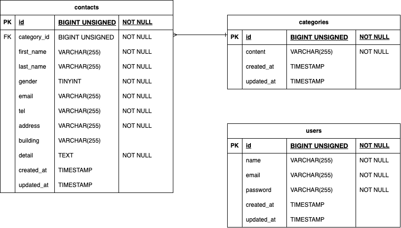

# お問い合わせフォーム

## 環境構築

### Dockerビルド
1. git clone git@github.com:misawayb/test-contact-form.git
2. docker-compose up -d

### Laravel環境構築
1. docker-compose exec php bash
2. composer install
3. cp .env.example .env 環境変数を適宜変更
4. php artisan key:generate
5. php artisan migrate
6. php artisan db:seed

### 開発環境
- http://localhost

### 使用技術（実行環境）
- PHP 8.4.19
- Laravel Framework 13.1.1
- MySQL 8.0.44
- nginx 1.21.1

### ER図
